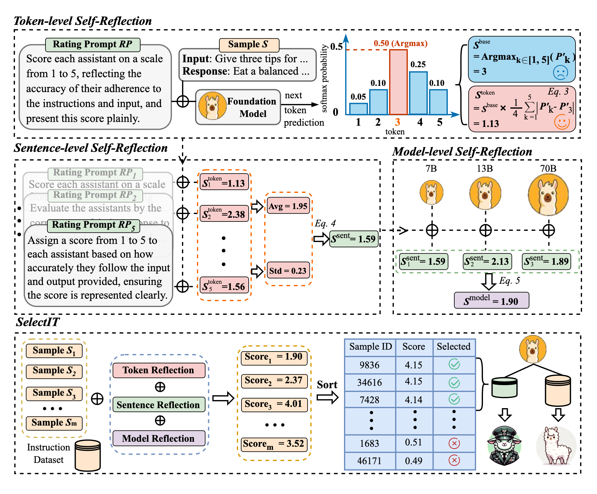

<div align="center">
    <h2>
    SelectIT: Selective Instruction Tuning for Large Language Models via Uncertainty-Aware Self-Reflection <br><br>
    </h2>
</div>


## Overview


We introduces a novel data selection strategy, SelectIT, for LLM instruction tuning, which uses LLM uncertainty to efficiently identify high-quality IT data without requiring additional resources.
SelectIT includes three types of self-reflection: token, sentence, and model, which can individually and jointly improve the performance of IT data selection.
By applying SelectIT to the Alpaca-GPT4 dataset, we introduce a compact and strong IT dataset, called Selective Alpaca. Different models and domain tasks demonstrate the effectiveness of SelectIT.
Our analysis reveals that SelectIT effectively excludes abnormal data and tends to select longer and calculational data.
<div align="center">
    
    <p class="image-caption">Figure 1: The overall framework of SelectIT.</p>
</div>


### Environment

Framework Versions:

- PyTorch >= 2.0.1
- Python  >= 3.10.0
- Transformers == 4.35.0
```
git clone git@github.com:Blue-Raincoat/SelectIT.git

pip3 install -r requirements.txt
```

## Data
We introduce a novel IT dataset, Selective Alpaca, by selecting the high-quality IT data from the Alpaca-GPT4 dataset.
- Alpaca_GPT4:  [Google](https://drive.google.com/file/d/1WQdBGL6zASMArKeXVRMKWSzkMqqe_1ns/view?usp=sharing) [HuggingFace](https://huggingface.co/datasets/liangxin/Alpaca_GPT4)
- Selective Alpaca: [Google](https://drive.google.com/file/d/1WQdBGL6zASMArKeXVRMKWSzkMqqe_1ns/view?usp=sharing) [HuggingFace](https://huggingface.co/datasets/liangxin/Selective_Alpaca)


## Self-Reflection

SelectIT employs different grain uncertainty of LLMs: token, sentence, and model, which can effectually improve the accuracy of IT data selection.

### Token-level Self-Reflection
We use the foundation model itself to rate the IT data  based on the uncertainty of various tokens.
```
python3 self_reflection/token_level.py \
    -model-name-or-path models--meta-llama--Llama-2-7b-hf \ # path of LLMs
    -rp ./data/rating_prompt.txt \ # path of rating_prompt
    -i ./data/alpaca_gpt4.json \  # path of instruction dataset
    -o ./data/test.json \ # path of output dataset
    -k 5 \ # hyper-parameters
    -proportion 0.2 \ # the number of instruction data
    -alpha 0.2 \ # hyper-parameters
    
```


### Sentence-level Self-Reflection
We use sentence-level uncertainty to improve the rating process by exploiting the effect of different prompts on LLMs.
```
python3 self_reflection/sentence_level.py \
    -model-name-or-path models--meta-llama--Llama-2-7b-hf \
    -rp ./data/rating_prompt.txt \
    -i ./data/alpaca_gpt4.json \
    -o ./data/test.json \
    -k 5
    -proportion 0.2 \
    -alpha 0.2 \
```


### Model-level Self-Reflection
We utilize the uncertainty between different LLMs, enabling a collaborative decision-making process for IT data selection.
```
python3 self_reflection/model_level.py \
    -model-name-or-path models--meta-llama--Llama-2-7b-hf,models--meta-llama--Llama-2-13b-hf,models--meta-llama--Llama-2-70b-hf \
    -rp ./data/rating_prompt.txt \
    -i ./data/alpaca_gpt4.json \
    -o ./data/test.json \
    -k 5
    -proportion 0.2 \
    -alpha 0.2 \
```


## Train
We provide two training configuration for different LLMs, which can effectively verify the robustness of SelectIT.
### LLaMA-2-7B
We can utilize the following training configuration  to fine tune the LLaMA-2 LLMs.
Example usages on 4 A800 by 1 node:
```
export NCCL_SOCKET_IFNAME=eno1
export MASTER_PORT=9909
start_time="$(date "+%Y-%m-%d-%H-%M-%S")"

deepspeed --master_addr "localhost" --master_port $MASTER_PORT \
    ./train/train.py \
    --deepspeed ./train/deepspeed_zero2.conf \
    --model_name_or_path "./models--meta-llama--Llama-2-7b-hf" \
    --model_max_length 4096 \
    --data_path ./data/Selective_Alpaca.json \
    --output_dir ./output_ckpt/llama2_7b_Selective_Alpaca \
    --bf16 True \
    --num_train_epochs 3 \
    --per_device_train_batch_size 32 \
    --per_device_eval_batch_size 4 \
    --gradient_accumulation_steps 1 \
    --save_strategy "steps" \
    --save_steps 500 \
    --evaluation_strategy "no" \
    --save_total_limit 999 \
    --learning_rate 2e-5 \
    --weight_decay 0. \
    --warmup_ratio 0.03 \
    --lr_scheduler_type "cosine" \
    --logging_steps 1 \
    --tf32 True \
    --gradient_checkpointing True
```


### Mistral-7B

We can utilize the following configuration parameters to fine tune the Mistral LLMs.
Example usages on 4 A800 by 1 node:
```
export NCCL_SOCKET_IFNAME=eno1
export MASTER_PORT=9909
start_time="$(date "+%Y-%m-%d-%H-%M-%S")"

deepspeed --master_addr "localhost" --master_port $MASTER_PORT \
    ./train/train.py \
    --deepspeed ./train/deepspeed_zero2.conf \
    --model_name_or_path "./models--Mistral-7B-hf" \
    --model_max_length 4096 \
    --data_path ./data/Selective_Alpaca.json \
    --output_dir ./output_ckpt/mistral_7b_Selective_Alpaca \
    --bf16 True \
    --num_train_epochs 1 \
    --per_device_train_batch_size 32 \
    --per_device_eval_batch_size 4 \
    --gradient_accumulation_steps 1 \
    --save_strategy "steps" \
    --save_steps 500 \
    --evaluation_strategy "no" \
    --save_total_limit 999 \
    --learning_rate 2e-5 \
    --weight_decay 0. \
    --warmup_ratio 0.03 \
    --lr_scheduler_type "cosine" \
    --logging_steps 1 \
    --tf32 True \
    --gradient_checkpointing True
```


## Evaluation
We provide the scripts for running the evaluation of large language models on the open-instruction which has a list of standard benchmarks targeting the core capabilities. 
These benchmarks include:
- MMLU
```
# Evaluating llama 7B model using 5 shot directly
python -m eval.mmlu.run_eval \
    --ntrain 5 \
    --data_dir data/eval/mmlu \
    --save_dir results/mmlu/llama-7B-5shot \
    --model_name_or_path ../hf_llama_models/7B \
    --tokenizer_name_or_path ../hf_llama_models/7B \
    --eval_batch_size 4 \
    --load_in_8bit
```

- GSM
```
# Evaluating llama 7B model using chain-of-thought
python -m eval.gsm.run_eval \
    --data_dir data/eval/gsm/ \
    --max_num_examples 200 \
    --save_dir results/gsm/llama-7B-cot-8shot \
    --model ../hf_llama_models/7B \
    --tokenizer ../hf_llama_models/7B \
    --n_shot 8 \
```

- BBH
```
# Evaluating llama 7B model using chain-of-thought
python -m eval.bbh.run_eval \
    --data_dir data/eval/bbh \
    --save_dir results/bbh/llama-7B-cot/ \
    --model ../hf_llama_models/7B \
    --tokenizer ../hf_llama_models/7B \
    --max_num_examples_per_task 40 \
```

- TydiQA
```
# Evaluating llama 7B model, with gold passage provided
python -m eval.tydiqa.run_eval \
    --data_dir data/eval/tydiqa/ \
    --n_shot 1 \
    --max_num_examples_per_lang 100 \
    --max_context_length 512 \
    --save_dir results/tydiqa/llama-7B-goldp \
    --model ../hf_llama_model/7B \
    --tokenizer ../hf_llama_model/7B \
    --eval_batch_size 20 \
    --load_in_8bit
```

- AlpacaEval
```
# Use V1 of alpaca farm evaluation.
export IS_ALPACA_EVAL_2=False

python -m eval.alpaca_farm.run_eval \
    --model_name_or_path ../checkpoints \
    --save_dir results/alpaca_farm/checkpoints/ \
    --eval_batch_size 20 \
    --use_chat_format \
    --chat_formatting_function eval.templates.create_prompt_with_tulu_chat_format
```


### Acknowledgement
This project cannot be developed without the following resources:
- Meta AI `LLaMA-2`: https://github.com/facebookresearch/llama
- `LLaMA-2` on HuggingFace: https://huggingface.co/meta-llama
- `Alpaca-GPT4` on HuggingFace: https://huggingface.co/datasets/vicgalle/alpaca-gpt4
- `Open-Instruct`: https://github.com/allenai/open-instruct
- `LLMZoo`: https://github.com/FreedomIntelligence/LLMZoo/tree/main

## Citation

If you find our work is useful to you, please cite our work:

```bibtex
@article{liu2024selectit,
   title={SelectIT: Selective Instruction Tuning for Large Language Models via Uncertainty-Aware Self-Reflection}, 
   author={Liangxin Liu and Xuebo Liu and Derek F. Wong and Dongfang Li and Ziyi Wang and Baotian Hu and Min Zhang},
   year={2024},
   journal={arXiv preprint arXiv:2402.16705},
}
```


